```mermaid
erDiagram
    USER {
        uuid id PK "NOT NULL, default=uuid"
        string cf_access_sub UK "NULLABLE, max_length=255, Cloudflare subのHMACハッシュ, required_if=is_active=true"
        string email UK "NOT NULL, max_length=255, case_insensitive"
        string display_name "NULLABLE, max_length=100, required_if=is_active=true"
        string profile "NULLABLE, max_length=300, required_if=is_active=true"
        string icon "NULLABLE, max_length=500"
        string header_image "NULLABLE, max_length=500"
        string role "NOT NULL, enum=admin|author, default=author"
        bool is_active "NOT NULL, default=false"
        timestamptz last_login_at "NULLABLE"
        timestamptz created_at "NOT NULL"
        timestamptz updated_at "NOT NULL"
    }

    CATEGORY {
        uuid id PK "NOT NULL, default=uuid"
        string name UK "NOT NULL, max_length=100"
        string slug UK "NOT NULL, max_length=120"
        uuid parent_id FK "NULLABLE"
        int sort_order "NOT NULL, default=0"
        int lft "NOT NULL, nested_set"
        int rght "NOT NULL, nested_set"
        int tree_id "NOT NULL"
        int level "NOT NULL, default=0"
        timestamptz created_at "NOT NULL"
        timestamptz updated_at "NOT NULL"
    }

    ARTICLE {
        uuid id PK "NOT NULL, default=uuid"
        uuid category_id FK "NOT NULL"
        uuid author_id FK "NOT NULL"
        string title "NOT NULL, max_length=255"
        string slug "NOT NULL, max_length=500"
        string summary "NOT NULL, max_length=200"
        text body_html "NOT NULL"
        string status "NOT NULL, enum=draft|publish|private, default=draft"
        string twitter_card "NOT NULL, enum=summary|summary_large_image, default=summary_large_image"
        timestamptz published_at "NULLABLE, required_if=status=publish, null_if=status!=publish"
        bigint views_total "NOT NULL, default=0"
        uuid thumbnail_asset_id FK "NOT NULL"
        jsonb toc_json "NOT NULL"
        string image_job_status "NOT NULL, enum=pending|processing|completed|failed, default=pending"
        uuid locked_by_id FK "NULLABLE, required_if=lock_token"
        timestamptz locked_at "NULLABLE, required_if=lock_token"
        uuid lock_token "NULLABLE, required_if=locked_by_id"
        timestamptz lock_expires_at "NULLABLE, required_if=lock_token"
        timestamptz created_at "NOT NULL"
        timestamptz updated_at "NOT NULL"
    }

    OPTION {
        uuid id PK "NOT NULL, default=uuid"
        string code UK "NOT NULL, max_length=64"
        string label "NOT NULL, max_length=100"
        text default_text "NULLABLE"
        timestamptz created_at "NOT NULL"
        timestamptz updated_at "NOT NULL"
    }

    ARTICLE_OPTION {
        uuid id PK "NOT NULL, default=uuid"
        uuid article_id FK "NOT NULL"
        uuid option_id FK "NOT NULL"
        text override_text "NULLABLE"
        timestamptz created_at "NOT NULL"
    }

    TAG {
        uuid id PK "NOT NULL, default=uuid"
        string name UK "NOT NULL, max_length=100"
        string slug UK "NOT NULL, max_length=120"
        timestamptz created_at "NOT NULL"
        timestamptz updated_at "NOT NULL"
    }

    ARTICLE_TAG {
        uuid id PK "NOT NULL, default=uuid"
        uuid article_id FK "NOT NULL"
        uuid tag_id FK "NOT NULL"
        timestamptz created_at "NOT NULL"
    }

    ARTICLE_PUBLISH_REQUEST {
        uuid id PK "NOT NULL, default=uuid"
        uuid article_id FK "NOT NULL"
        uuid requested_by_id FK "NOT NULL"
        timestamptz requested_at "NOT NULL"
        string status "NOT NULL, enum=pending|approved|rejected"
        uuid handled_by_id FK "NULLABLE"
        timestamptz handled_at "NULLABLE"
        text note "NULLABLE"
    }

    OGP_INFO {
        uuid id PK "NOT NULL, default=uuid"
        uuid article_id FK "NOT NULL"
        text url "NOT NULL, max_length=2048"
        text title "NULLABLE, max_length=512"
        text summary "NULLABLE"
        text thumbnail "NULLABLE, max_length=2048"
        timestamptz created_at "NOT NULL"
        timestamptz updated_at "NOT NULL"
    }

    MEDIA_ASSET {
        uuid id PK "NOT NULL, default=uuid"
        uuid article_id FK "NOT NULL"
        string file_name "NOT NULL, UNIQUE, max_length=255"
        int width "NOT NULL, check=positive"
        int height "NOT NULL, check=positive"
        string checksum_sha256 "NOT NULL, fixed_length=64"
        jsonb exif_json "NULLABLE, keys=ISO|F|SS|WB|機種名|レンズ|焦点距離"
        jsonb processing_options_json "NULLABLE"
        timestamptz created_at "NOT NULL"
        timestamptz updated_at "NOT NULL"
    }

    ARTICLE_SAVE_LOG {
        uuid id PK "NOT NULL, default=uuid"
        timestamptz occurred_at "NOT NULL"
        uuid request_user_id FK "NOT NULL"
        uuid lock_token "NOT NULL"
        string target "NULLABLE, max_length=255"
        string status "NOT NULL, enum=failed|started|completed"
        text message "NULLABLE"
    }

    CONTACT {
        uuid id PK "NOT NULL, default=uuid"
        string subject_type "NOT NULL, enum=review|blog"
        string company_name "NULLABLE, max_length=255"
        string person_name "NOT NULL, max_length=100"
        string email "NOT NULL, max_length=255"
        text body "NOT NULL"
        jsonb turnstile_meta "NULLABLE"
        timestamptz created_at "NOT NULL"
        timestamptz updated_at "NOT NULL"
    }

    CATEGORY ||--o{ ARTICLE : contains
    USER ||--o{ ARTICLE : authors
    USER ||--o{ ARTICLE : locks

    ARTICLE ||--o{ MEDIA_ASSET : owns
    ARTICLE ||--o{ ARTICLE_TAG : tagged_by
    TAG ||--o{ ARTICLE_TAG : tags

    ARTICLE ||--o{ OGP_INFO : links

    ARTICLE ||--o{ ARTICLE_PUBLISH_REQUEST : requests
    USER ||--o{ ARTICLE_PUBLISH_REQUEST : requested_by
    USER ||--o{ ARTICLE_PUBLISH_REQUEST : handled_by
    USER ||--o{ ARTICLE_SAVE_LOG : requested_by

    ARTICLE ||--o{ ARTICLE_OPTION : has_options
    OPTION ||--o{ ARTICLE_OPTION : applied_to
```

## 制約メモ（DB制約）

- 空ドラフトは作成しない。`ARTICLE` は初回保存時に必須項目を満たした状態で作成する。
- `category.slug` は `UNIQUE`
- `tag.slug` は `UNIQUE`
- `article.slug` はカテゴリ配下で一意: `UNIQUE(category_id, slug)`
- `article_tag` は重複禁止: `UNIQUE(article_id, tag_id)`
- `article_option` は重複禁止: `UNIQUE(article_id, option_id)`
- `media_asset.file_name` は重複禁止: `UNIQUE(file_name)`
- `user.cf_access_sub` は `UNIQUE`（Cloudflare Access `sub` の平文ではなく、HMACハッシュを保存する）
- `user.email` は `UNIQUE`（大文字小文字を同一視する実装を推奨）
- `user.role` は列挙制約: `admin/author`
- `user.profile` は `max_length=300`
- `user` は `CHECK (NOT is_active OR (cf_access_sub IS NOT NULL AND display_name IS NOT NULL AND profile IS NOT NULL AND char_length(btrim(display_name)) > 0 AND char_length(btrim(profile)) > 0))` を推奨
- `article_publish_request.status` は列挙制約（例: `pending/approved/rejected`）
- `article.status` は列挙制約（例: `draft/publish/private`）+ `DEFAULT 'draft'`
- `article.twitter_card` は列挙制約（例: `summary/summary_large_image`）+ `DEFAULT 'summary_large_image'`
- `article.image_job_status` は列挙制約（例: `pending/processing/completed/failed`）+ `DEFAULT 'pending'`
- `article.title` / `article.slug` / `article.summary` / `article.body_html` は空文字禁止を推奨: `CHECK (char_length(btrim(col)) > 0)`
- `article.views_total` は負数禁止を推奨: `CHECK (views_total >= 0)`
- `article` は公開状態と公開日時の整合を推奨: `CHECK ((status = 'publish' AND published_at IS NOT NULL) OR (status <> 'publish' AND published_at IS NULL))`
- `article.thumbnail_asset_id` は常時 `NOT NULL`（`default` モード時も `MEDIA_ASSET` の既存デフォルト画像IDを参照）
- `article` はロック4項目（`locked_by_id`, `locked_at`, `lock_token`, `lock_expires_at`）を同時NULLまたは同時NOT NULLにする `CHECK` を推奨
- `article` はロック期限の前後関係を推奨: `CHECK (lock_expires_at IS NULL OR lock_expires_at > locked_at)`
- `article_save_log.status` は列挙制約（例: `failed/started/completed`）
- `contact.subject_type` は列挙制約（例: `review/blog`）

## ARTICLE_SAVE_LOG運用メモ

- 記事保存フローの監査用ログを保持する。
- カラムは `occurred_at`, `request_user_id`, `lock_token`, `target`, `status`, `message` を持つ。
- `request_user_id` カラムには、`USER.id` の UUID を保存する。
- フロントはAPI経由で、`request_user_id` や時間範囲を条件に絞り込んで参照する。
- 詳細ログの保存先はログファイルではなくDBテーブルとする。

## オプション運用メモ

- `is_pr` / `is_ad` は `ARTICLE` カラムで持たず、`ARTICLE_OPTION` で管理する。
- `OPTION.code` に `pr` / `ad` を登録し、記事への適用は `ARTICLE_OPTION` で表現する。
- 将来オプション追加（例: `sponsored`）は `OPTION` 追加のみで対応する。

## CONTACT運用メモ

- `CONTACT` テーブルには `email` のみ保存する。

## MEDIA_ASSET運用メモ

- `MEDIA_ASSET.id` は内部識別子であり、画像ファイル名そのものではない。
- 画像参照に必要なファイル名は `file_name` に保存する。
- `processing_options_json` には実際に適用した画像処理オプションを保存する。
- `exif_json` のキーは `ISO`, `F`, `SS`, `WB`, `機種名`, `レンズ`, `焦点距離` を使用する。
