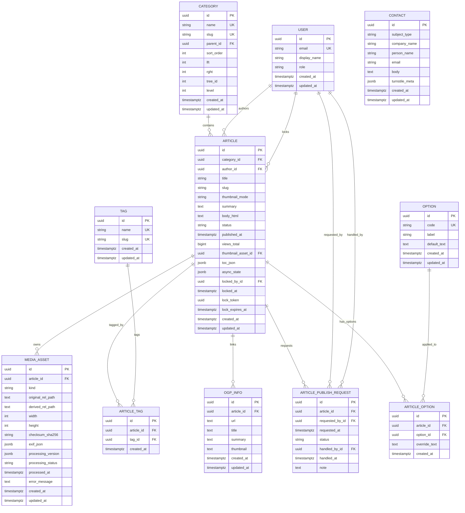

## 制約メモ（DB制約）

- `category.slug` は `UNIQUE`
- `tag.slug` は `UNIQUE`
- `article.slug` はカテゴリ配下で一意: `UNIQUE(category_id, slug)`
- `article_tag` は重複禁止: `UNIQUE(article_id, tag_id)`
- `article_option` は重複禁止: `UNIQUE(article_id, option_id)`
- `article_publish_request.status` は列挙制約（例: `pending/approved/rejected`）
- `article.status` は列挙制約（例: `draft/private/published`）

## オプション運用メモ

- `is_pr` / `is_ad` は `ARTICLE` カラムで持たず、`ARTICLE_OPTION` で管理する。
- `OPTION.code` に `pr` / `ad` / `non_monetized` を登録し、記事への適用は `ARTICLE_OPTION` で表現する。
- `non_monetized` が付与された記事は、公開側で AdSense スクリプトを読み込まない。
- 将来オプション追加（例: `sponsored`）は `OPTION` 追加のみで対応する。

## CONTACT運用メモ

- `email_confirm` は問い合わせAPIの入力確認用フィールドであり、DBには保存しない。
- `CONTACT` テーブルには `email` のみ保存する。
